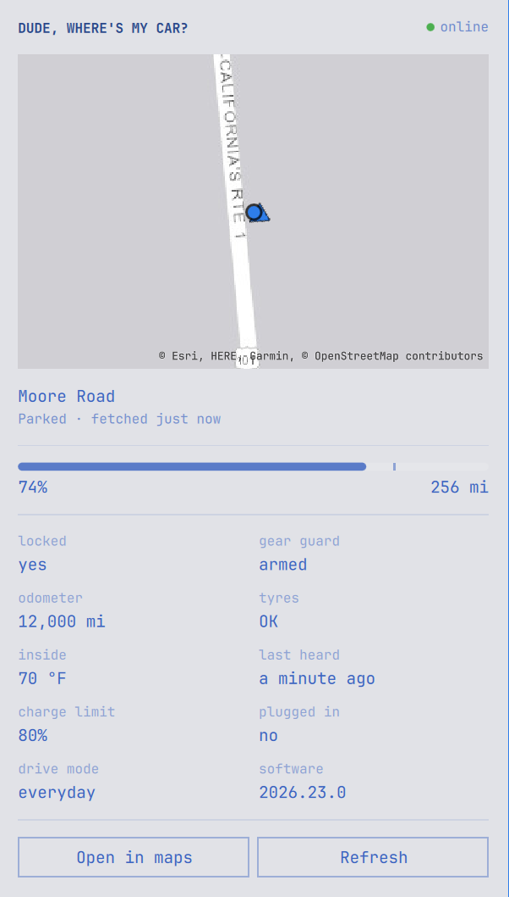

# Rivian

An [Omarchy](https://omarchy.org) bar widget for a Rivian. The bar shows the
compass and nothing else. Click it and a panel comes down with a map of where
the car is, which way it is pointing, how full the battery is, how far that
gets you, and the handful of things you actually end up wondering about a
parked car.



*A car that does not exist, parked somewhere it has never been — see
[Screenshots](#screenshots) below.*

Reading the car costs it nothing — see
[It cannot flatten your battery](#it-cannot-flatten-your-battery).

## Install

```bash
omarchy plugin add https://github.com/kayleg/omarchy-rivian.git --enable
```

The widget lands in the right section of the bar. Move it with
`omarchy bar move`, or from the bar's own settings panel.

Click it and it will ask you to sign in, in the panel itself. There is nothing
to run in a terminal.

## Signing in

Read this part and decide about it on purpose.

Rivian's app API has **no OAuth flow, no scoped API key, and no token you can go
and generate**. The only way in is to POST the account's own email and password
to Rivian's gateway and answer a one-time code. There is no arrangement in which
a third-party tool never sees your password, because Rivian does not offer one.

The panel does that for you: open the widget while signed out and it shows an
email box, a password box, then a box for the code Rivian sends. When the
session lapses — it will, periodically — the same form comes back on its own.

What happens to the two secrets:

- **Neither is ever a command-line argument.** Everything in `argv` shows up in
  `/proc/<pid>/cmdline`, which is world-readable: any process on the machine,
  running as any user, can read the arguments of a running process. The panel
  writes the password down a pipe to `bin/rivian`, which writes the request
  body down another pipe to `curl`. Nothing that carries a secret is ever
  visible in a process listing.
- **The password is never written to disk**, and the QML clears its own copy in
  the same handler that spends it.
- **Tokens** go in `~/.config/omarchy-rivian/session.json`, mode 600, in a
  directory kept at mode 700.
- Between the password and the code, a `pending-otp.json` (also mode 600) holds
  the email and Rivian's OTP token so the panel does not have to keep anything
  itself. It is deleted the moment it is spent.
- `rivian logout` deletes all of it.

The terminal path still exists if you prefer it — `rivian login` prompts with
the echo off and does exactly the same thing.

No amount of care in this script changes the fact that your password transits
it. If that is not a trade you want to make, this is the point to stop.

## It cannot flatten your battery

**This widget never touches the car.** Rivian's vehicle pushes telemetry
up to Rivian's cloud on its own schedule, and `vehicleState` reads that cloud.
The car is not what answers. Every field comes back with its own `timeStamp`,
and the connection reports its own `lastSync` — the shape of a cache, not of a
live poll.

So there is no wake command, no sleep policy, and no throttle protecting the
battery, because there is nothing here that could drain one. Turn
`statePollMinutes` down to 1 if you like; it costs the car nothing. The reuse
window in the script is politeness to Rivian's gateway and nothing more.

What you give up instead is any guarantee of freshness. A car parked in an
underground car park has not moved, but nor has anything about it been heard,
and from here those two look identical. That is what the panel's **last heard**
cell is for.

## What it shows

| | |
| --- | --- |
| Where it is | map, marker, heading, and the street and town by name |
| How full | battery %, charge limit, range in miles or km |
| Charging | whether it is plugged in, and the clock time it finishes |
| Driving | speed, and the map keeping up |
| Locked | doors, and Gear Guard |
| Open | any door, frunk, liftgate, tailgate, tonneau or window that is not shut |
| Tyres | Rivian reports a verdict per corner, not a pressure, so: OK, or how many are low |
| Odometer, drive mode, software | with an ↑ when an update is waiting |
| Last heard | when the cloud last got anything from the car |

Rivian's API does not expose **charger power in kW**, **outside temperature**,
or the **active navigation route**, so the panel does not pretend to them.
Rivian does expose trip planning through a separate endpoint, but a route you
asked a server to plan is not the route the car is driving, and showing the
first as the second would be a lie in a small font.

It is read-only. Vehicle commands need a phone key whose one-time in-vehicle
pairing has not been worked out for Gen2 (2025+) cars, so there is nothing here
that locks, unlocks or preconditions anything.

## Units

Rivian reports metric on the wire whatever the car's own screen is set to, and
does not say which the screen shows — so there is nothing to follow and it has
to be a setting. **Auto** reads your locale and is right for
almost everybody; **Miles** and **Kilometres** override it.

## The CLI

`bin/rivian` is the whole of what talks to Rivian, so the QML never holds a
credential. It is useful on its own:

```bash
rivian login           # sign in at a terminal, instead of in the panel
rivian logout          # forget the tokens
rivian vehicles        # the cars on the account, with their VINs
rivian state           # the summary the bar shows
rivian car             # everything the panel shows, as JSON
rivian car --force     # skip the reuse window
rivian place LAT LON   # a coordinate as a street and a town
```

`state` and `car` share one cached reading, so a bar polling every five minutes
and a panel you open between polls cost one call between them.

## Working on it without a car

Drop a reading in `~/.config/omarchy-rivian/fixture.json` and `state` and `car`
serve that instead of asking Rivian anything:

```bash
mkdir -p ~/.config/omarchy-rivian
./bin/rivian render < tests/fixtures/gateway-driving.json \
  > ~/.config/omarchy-rivian/fixture.json
```

Delete the file to go back to the real car. There is also a test hook for
things that are awkward to arrange on a real one:

```bash
omarchy-shell kayleg.rivian.test drive 65 243
omarchy-shell kayleg.rivian.test charge 47
omarchy-shell kayleg.rivian.test park
omarchy-shell kayleg.rivian.test sleep
omarchy-shell kayleg.rivian.test live      # back to the real car
```

`render` maps a saved gateway answer to a reading, which is also the thing to
run when Rivian renames a field: save what the gateway said, pipe it in, and
the difference between the two is the bug.

## Screenshots

A picture of this widget is a picture of where your car is, which is not
something to put in a README. The fixture mechanism exists partly for this: put
a car that does not exist in front of the panel, photograph that, and take it
away again.

```bash
# A fabricated car — invented VIN, generic name, parked on a public street.
./bin/rivian render "Rivian" "7FCTGAAA0PN000000" "R1S" 2025 \
  < tests/fixtures/gateway-demo.json > ~/.config/omarchy-rivian/fixture.json

omarchy-shell kayleg.rivian.test live    # re-read, so the panel picks it up
omarchy-shell kayleg.rivian.test open    # open it without a mouse

grim -o YOUR-OUTPUT shot.png             # then crop to the panel

omarchy-shell kayleg.rivian.test close
rm ~/.config/omarchy-rivian/fixture.json # back to the real car
omarchy-shell kayleg.rivian.test live
```

`gateway-demo.json` sets `cloudConnection.lastSync` to a fixed time, so "last
heard" will read as however long ago that is. Restamp it first if you want it
to look freshly synced:

```bash
jq -c --arg s "$(date -u -d '60 seconds ago' '+%Y-%m-%dT%H:%M:%S.000Z')" \
  '.data.vehicleState.cloudConnection.lastSync=$s' tests/fixtures/gateway-demo.json | ...
```

Crop to the panel and nothing else. Whatever is behind it is your desktop.

## Tests

```bash
./tests/run
```

Every assertion runs the real mapping over a saved gateway answer, so a
renamed field fails a test rather than silently blanking a cell.

## Privacy

Both `~/.config/omarchy-rivian` and `~/.cache/omarchy-rivian` are kept at mode
700, and not only for the tokens: the cache holds the last known position, and
the geocode cache spells coordinates out in its own filenames, so a listing of
it is a movement log. `rivian logout` removes the tokens and deliberately
leaves the cache alone — delete it yourself if you want the history gone.

Rivian learns what it was always going to learn. OpenStreetMap's Nominatim
learns the coordinates, if `showAddress` is on; turn it off and nothing but
Rivian knows where the car is. Esri serves the map tiles and therefore sees
roughly where you are looking, at tile resolution; the same is true of
OpenStreetMap if you pick that style.

## Unofficial

This uses the API Rivian's own mobile app uses. It is not documented, not
supported, and not guaranteed to keep working; field names have changed before
and will again. Not affiliated with or endorsed by Rivian. The field names came
from the community's [unofficial API
documentation](https://rivian-api.kaedenb.org/) and
[rivian-python-api](https://github.com/the-mace/rivian-python-api).

## Licence

MIT. Includes work from [omarchy-tesla](https://github.com/jankeesvw/omarchy-tesla),
copyright (c) 2026 Jankees van Woezik, MIT — see `NOTICE`.
